# Project Workflow Diagrams

Quick reference for visual workflow understanding | [Home](README.md)

---

## 1️⃣ System Architecture

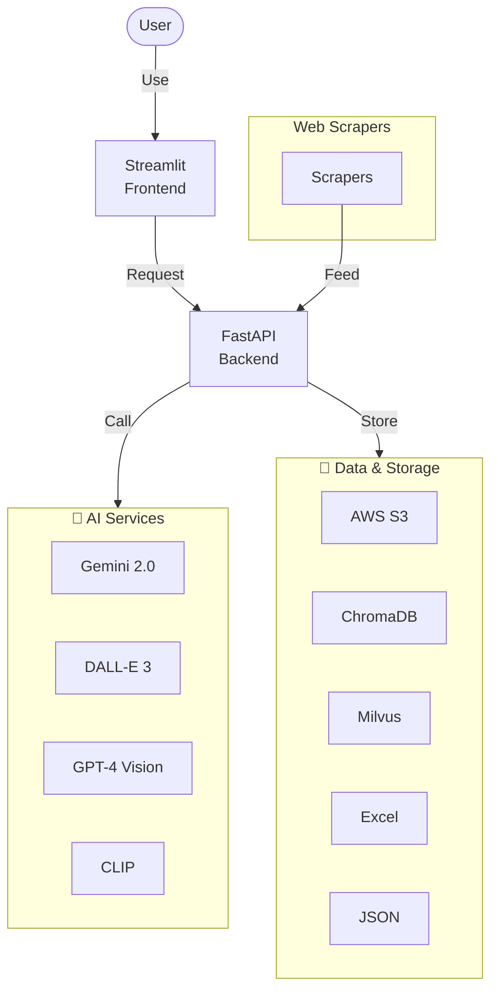

---

## 2️⃣ Image Generation Pipeline

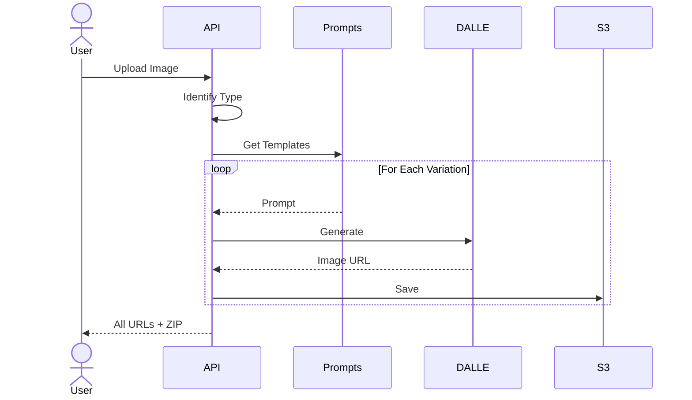

---

## 3️⃣ Catalog Generation

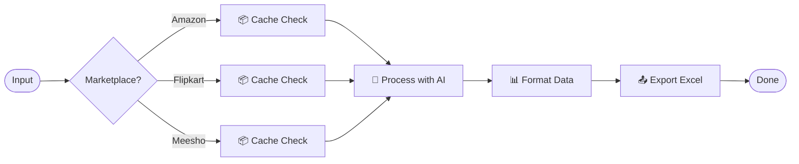

---

## 4️⃣ Duplicate Detection

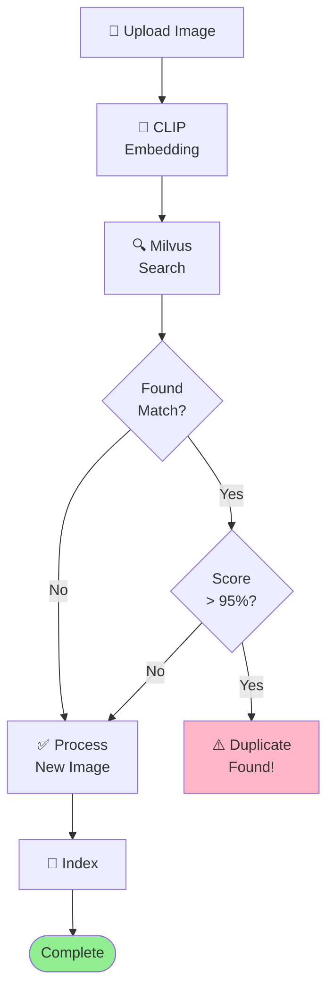

---

## 5️⃣ Vector Search & Storage

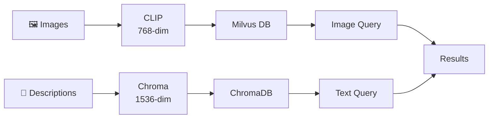

---

## 6️⃣ API Request Lifecycle

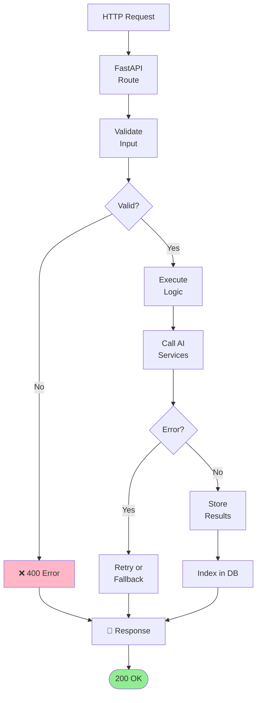

---

## 7️⃣ Marketplace Pipelines

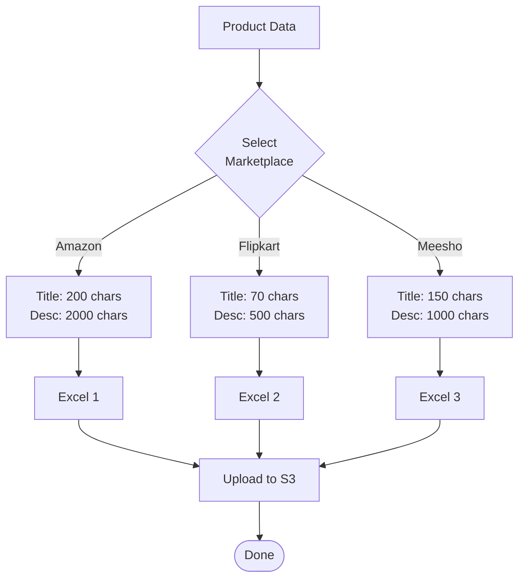

---

## 8️⃣ Error Recovery

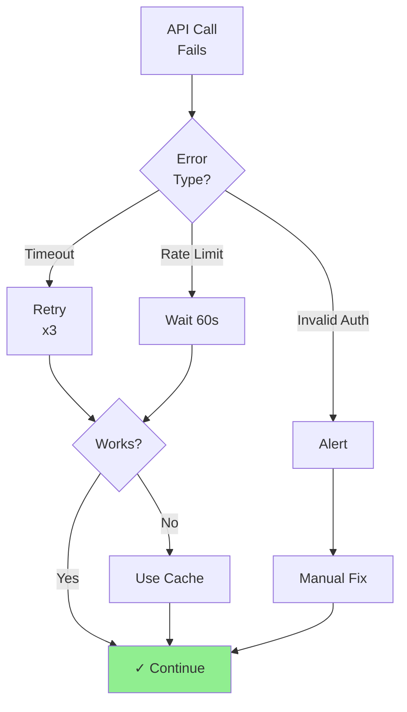

---

## 9️⃣ User Journey

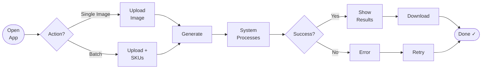

---

## 1️⃣0️⃣ Similarity Detection

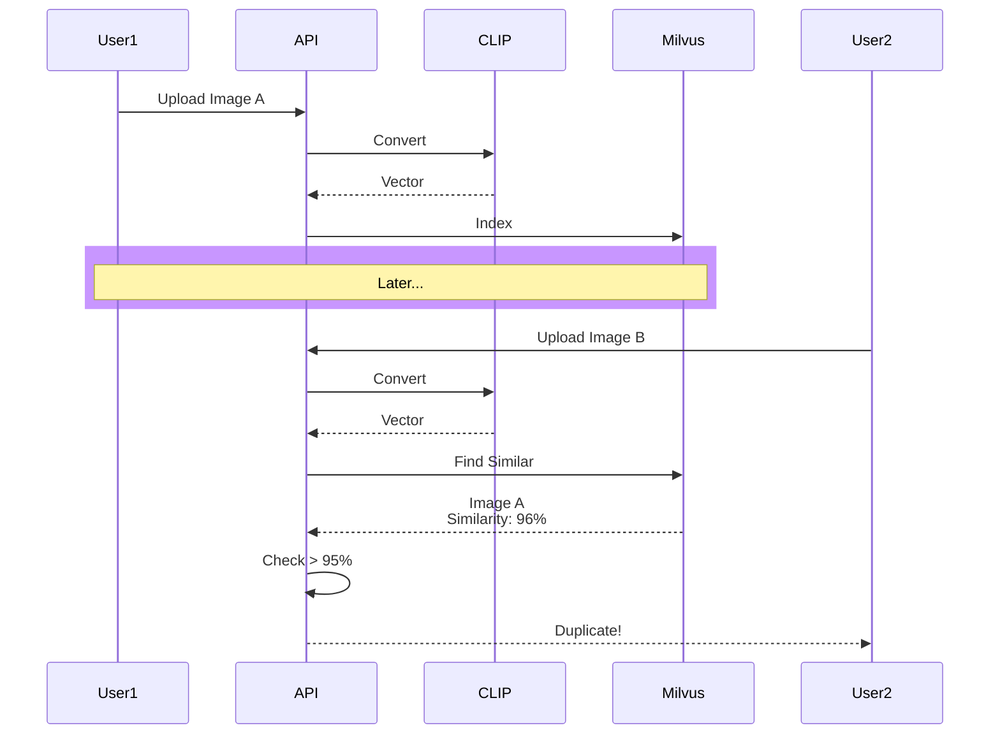

---

## 1️⃣1️⃣ Web Scraping

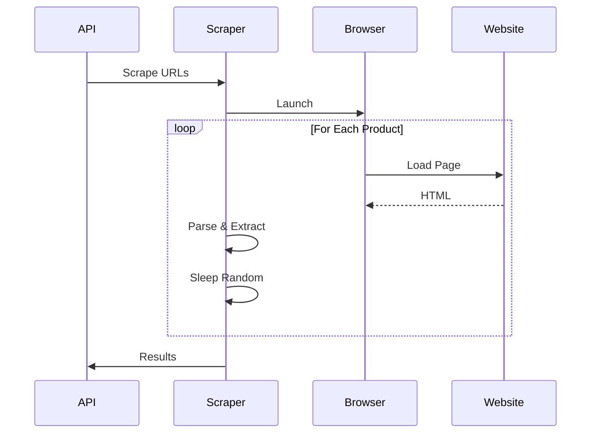

---

## 1️⃣2️⃣ Catalog Caching

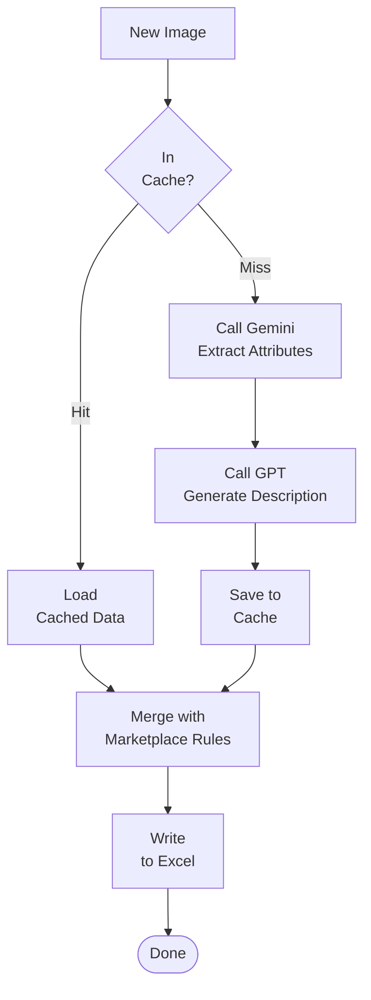

---

**[← Home](README.md)**
